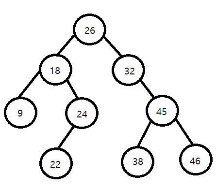
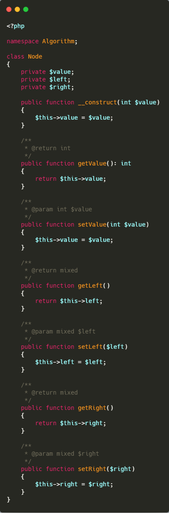
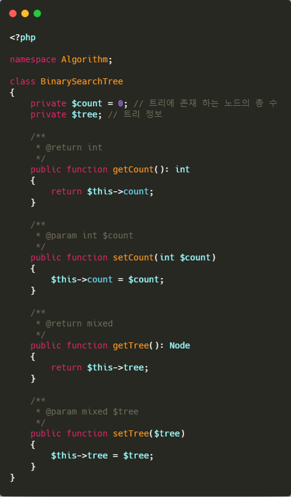
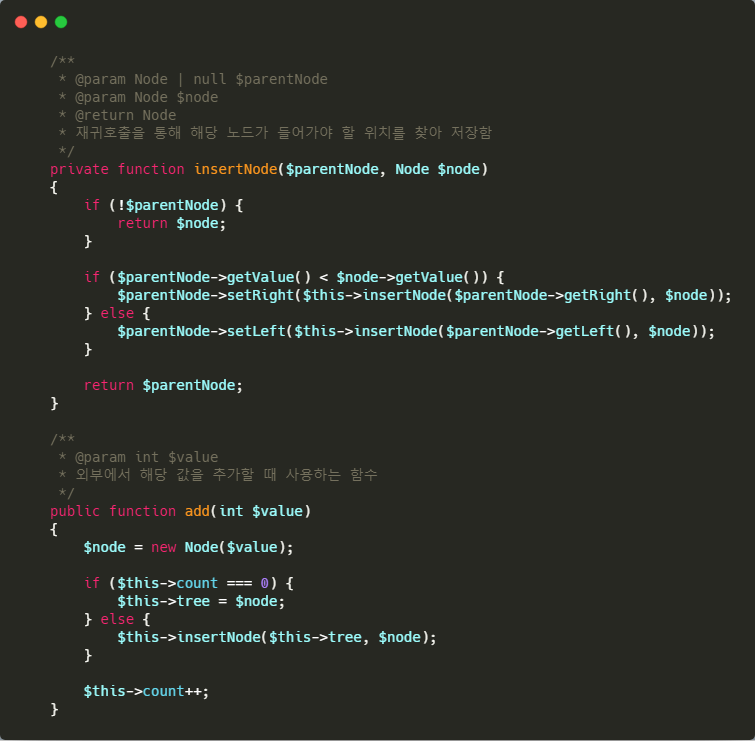
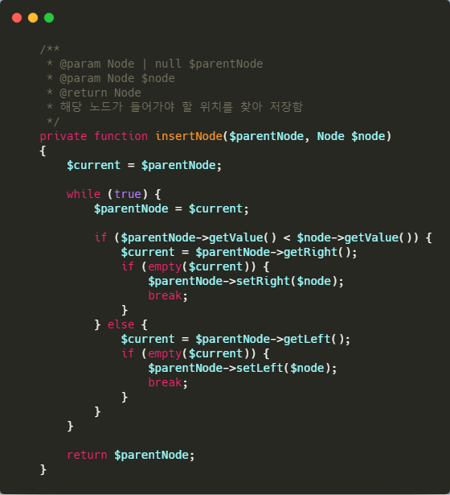
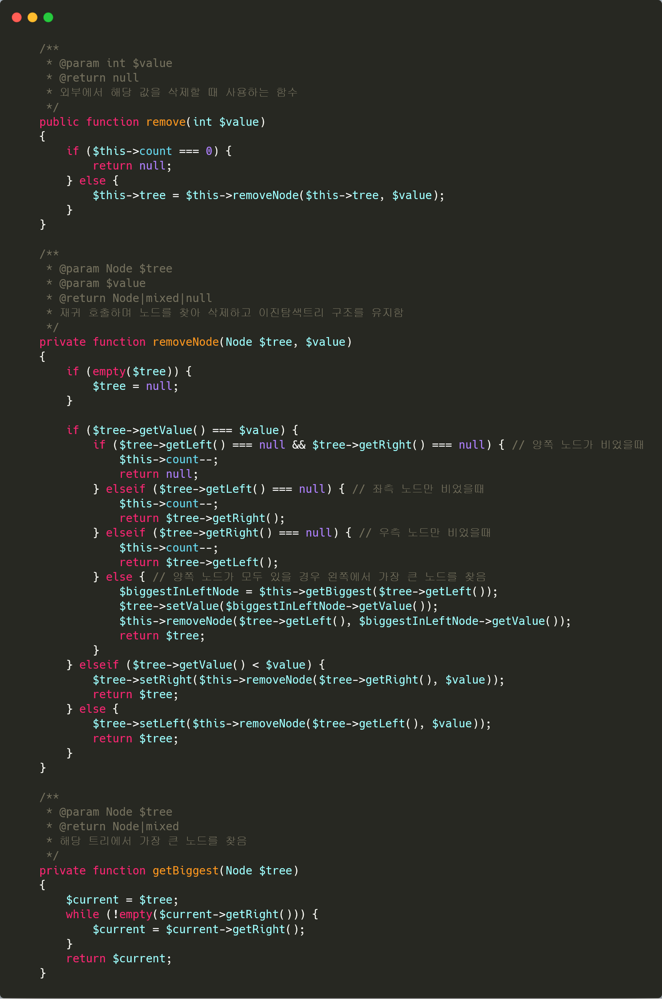

# 이진탐색트리

## 정의
- 최대 2개의 노드를 좌우로 가질 수 있는 노드로,
완전 이진형 트리이다.

- 각 노드의 왼쪽 서브 노드는 해당 노드보다 작은 값으로 구성되어 있으며,

- 각 노드의 오른쪽 서브 노드는 해당 노드보다 큰 값으로만 구성된다.

- 중복된 값을 가진 노드가 없어야한다.

- 루트노드를 기준으로 왼쪽은 해당 노드보다 작은 값들만 구성되어 있고, 오른쪽은 큰 값으로만 구성된다.

- 정렬 되어 있어 검색에 용이하다.

## 예시

26 - 32 - 18 - 45 - 9 - 24 - 22 - 46 - 38 순으로 데이터 입력시 아래와 같은 트리구조를 형성 하게 된다.
 

## 예제 코드

### 각 노드 정보를 담을 클래스 작성

우선적으로 노드를 표현 할 Node 클래스를 생성 한다.

노드는 자기 자신의 값인 `value` 와 `left`, `right`를 가지게 된다.

#### `Node.php`

### 기본 클래스 작성

트리 구조를 가지기 위한 BinarySearchTree 클래스를 생성한다.

Tree정보를 가지고 있는 tree 프로퍼티와 현재 트리에 존재하는 Node의 수를 가지고 있는 프로퍼티만 존재한다.

#### `BinarySearchTree.php`

### Add 함수 생성

값을 추가하기 위한 add 함수를 생성한다.

노드를 생성하여 값을 첫 추가하는 경우에는 해당 노드를 트리에 바로 저장하고,

~~아닐 경우, 재귀를 통해 해당 노드가 들어갈 위치를 찾아 저장한다.~~

위와 같이 작성 할 경우 해당 위치를 찾아 SET을 하는게 아닌, 루트 이하의 전체 노드를 Set 하게 되어,

아래와 같이 변경하였다.

(메모리상 효율이 있을것 같은데, phpUnit으로 테스트 해 보았을 때
 실행시간도 제각각이고, 메모리는 10MB로 고정이라 확인이 어려웠다.
 내가 phpUnit을 잘못 쓰고 있는건 아닐까....)

### Remove 함수 생성

값을 삭제하기위한 remove 함수를 생성한다.

노드를 삭제할때에는 우선 해당 노드를 찾아 가야한다.

이진탐색트리의 구조를 활용하면 이를 쉽게 찾을 수 있다.

해당 노드를 찾아 삭제한 후, 하위 노드가 있을 경우 하위노드를 위로 끌어 올려 삭제된 위치를 채운다.

여기서 주의할 점은 좌/우 노드가 모두 존재할 경우에는 이진 탐색 트리의 형태를 유지 하기 위해 해당 노드의 좌측의 노드중 가장 큰 노드를 찾아

삭제하려는 노드와 위치를 변경한 후, 삭제하려던 노드를 삭제 처리한다.

이와 같이 처리하는 이유는 좌측의 노드중 가장 큰 노드가 해당 위치로 올 경우에 해당 상태를 유지할 수 있기 때문이다.

다른 방법으로는 우측에서 가장 작은 노드를 찾아 이와 같이 처리 할 수 있다.

> 참고 자료 
- https://www.zerocho.com/category/Algorithm/post/580ed6eb77023c0015ee9686
- https://ratsgo.github.io/data%20structure&algorithm/2017/10/22/bst/
- https://jeong-pro.tistory.com/131